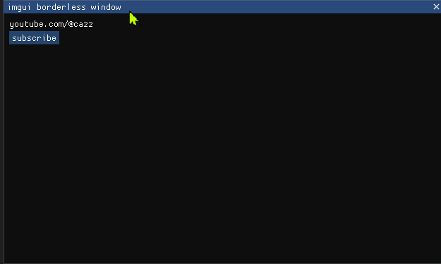

# 🛰 About

A clean, simple and portable Borderless ImGui Window base for your menu/application needs.



## 🌠 Video

This project was developed during one of my (awesome) tutorials on YouTube:

- [Make a Proper Menu with ImGUI](https://www.youtube.com/watch?v=Nrta_J_c9Cc)

It was originally designed (years ago) as an external cheat menu/base for CS:GO, but can easily be used for any purpose you want. I have updated it to use DirectX 11 instead of DirectX 9, which makes it compatible with more modern applications.

> [!NOTE]
> If you're looking for the original DirectX 9 version from the video, you can find it in the [original branch](https://github.com/cazzwastaken/borderless-imgui-window/tree/original) of this repository. Keep in mind that DirectX 9 is now deprecated and no longer comes pre-installed on Windows.

## 🌌 Getting Started

The only platform currently supported is Windows as it relies on DirectX and Win32 APIs. I am considering future UNIX support, but it is not a priority and greatly increases complexity.

Make sure you have the following prerequisites installed:

- **MSVC** (v143 or later for C++20 support)
- **Windows SDK** (v10.0 or later)
- [optional] **CMake** (v3.20 or later) for using VSCode or other IDEs
- [optional] **Git** for cloning the repository

Clone the repository:

```bash
# Either download the ZIP or use Git:
git clone https://github.com/cazzwastaken/borderless-imgui-window.git
cd borderless-imgui-window
```

Follow one of the build methods below:

**Visual Studio:**

1. Open `cheat-menu.sln` in Visual Studio
2. Select `Release` or `Debug` configuration
3. Build the solution (Ctrl + Shift + B)

**CMake:**

```bash
mkdir build && cd build
cmake ..
cmake --build . --config Release
```

## 🗿 Disclaimer

This software is provided as-is for educational purposes only. I am not responsible for anything that you do or that happens to you when using this software. Be safe and have fun!

## � Contributing

Interested in contributing? Check out the [CONTRIBUTING.md](CONTRIBUTING.md) guide for development setup and guidelines.

## �🪐 License

This project is licensed under the MIT License - see the [LICENSE](LICENSE) file for details.
